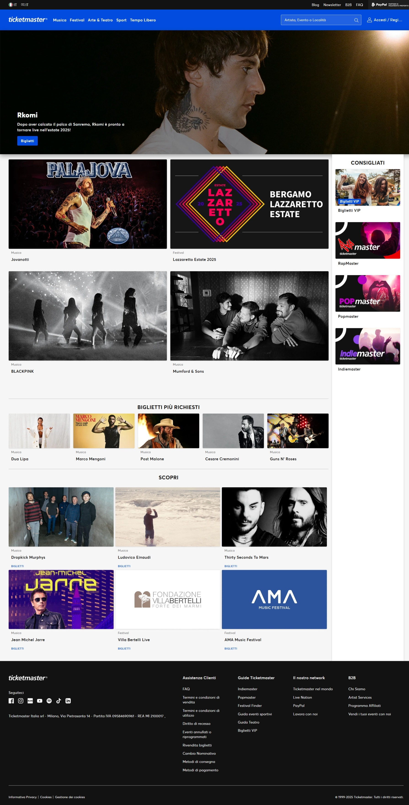
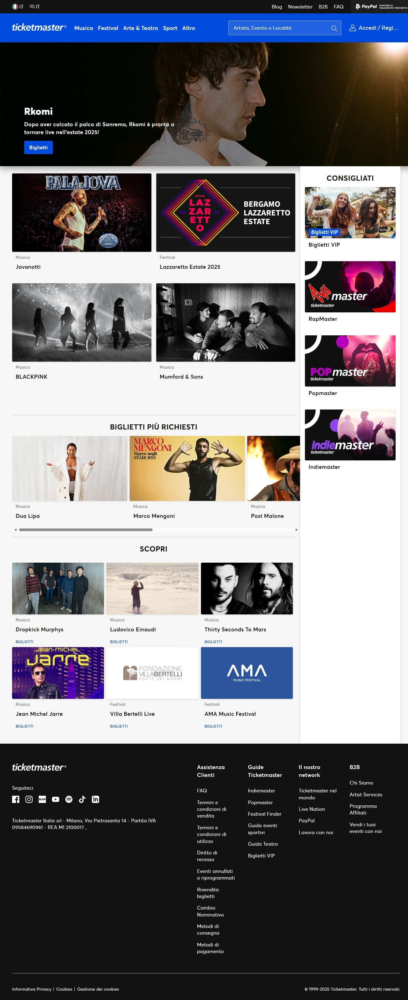
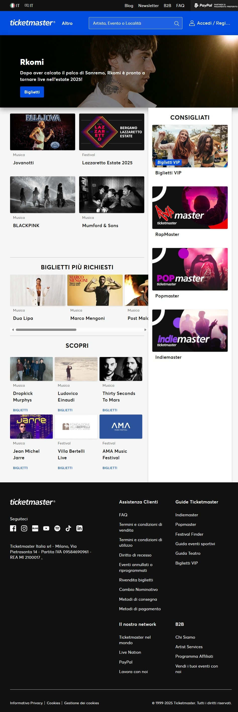
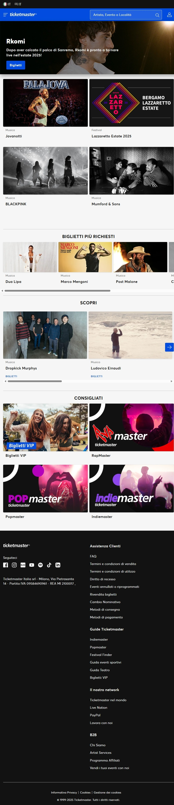
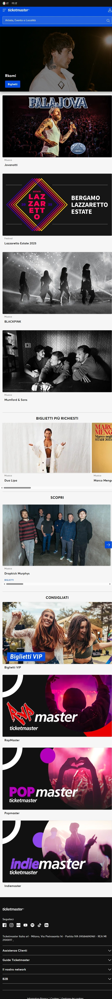

# MiniHomework 1
Consegna del primo minihomework di Web Programming.

[Il sito ricostruito è visitabile tramite GitHub Pages
quì](https://jackdispade21.github.io/mhw1/mhw1.html).

Si allegano in basso gli screenshot del sito originale, in tutte le configurazioni possibili.

Inoltre, anche se non allegato in basso, i pulsanti di navigazione sul sito originale scompaiono man mano che finisce lo spazio, questo è stato riprodotto tramite media queries.

# Screenshots

## Desktop - fino a 1400px

    
Apri Screenshot

    

## Laptop - meno di 1400px

    
Apri Screenshot

    

## Footer a griglia in configurazione mista - range 900px-1100px

    
Apri Screenshot

    

## Tablet - fino a 900px

    
Apri Screenshot

    

## Mobile - fino a 720px

    
Apri Screenshot

    

